# Web Application Programming and Hacking

## Instructor: Dr. Phu Phung

## Student

**Name**: Mahitha Kalaga

**Email**: [kalagam1@udayton.edu](kalagam1@udayton.edu)

## Repository Information

Repository's URL: [https://github.com/kalagam1/waph-kalagam1.git](https://github.com/kalagam1/waph-kalagam1.git)

This is a private repository for Mahitha Kalaga to store all the code from the course. The organization of this repository is as follows.

### Labs

[Hands-on exercises in Lectures](labs)

- [Lab 0](labs/lab0): Development Environment Setup
- [Lab 1](labs/lab1): Foundations of the Web
- [Lab 2](labs/lab2): Front-end Web Development

### Hackathons

- [Hackathon 1](hackathon1): Cross-site Scripting Attacks and Defenses

## Report

## The Hackathon's overview

This hackathon focused on identifying and exploiting reflected Cross-Site Scripting (XSS) vulnerabilities through a series of hands-on web security exercises. Covered in Lectures 7 and 8, the hackathon included two tasks: performing XSS attacks across seven levels of increasing difficulty, and implementing proper defenses in insecure web applications from Lab 1 and Lab 2.

Hackathon's URL: [Hackathon](https://github.com/kalagam1/waph-kalagam1/tree/main/hackathon1)

Demo URL: [Video Demo](https://1drv.ms/v/c/2b4aedabaf61a0bf/EQTUZZdYsBFFhUt9w9HdBVgBU-IHNXLMJD8WDwmk-ACyAA?e=OWtqhS)

## Task 1: Attacks

In this task, I performed reflected XSS attacks on levels 0 to 6 by injecting custom payloads to display messages like "Hacked by Mahitha Kalaga". For each level, I bypassed filters using different techniques such as using image tags, obfuscated scripts, and DOM manipulation, and identified the likely vulnerable PHP code behind each level.

### Level 0: 

I injected a basic scriptalert('Level 0: Hacked by Mahitha Kalaga')script payload. Since there was no input filtering, the alert executed successfully.

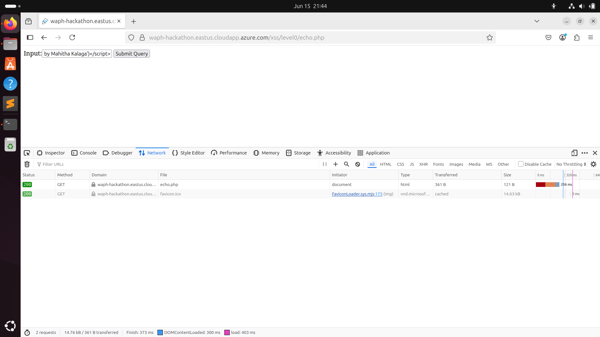

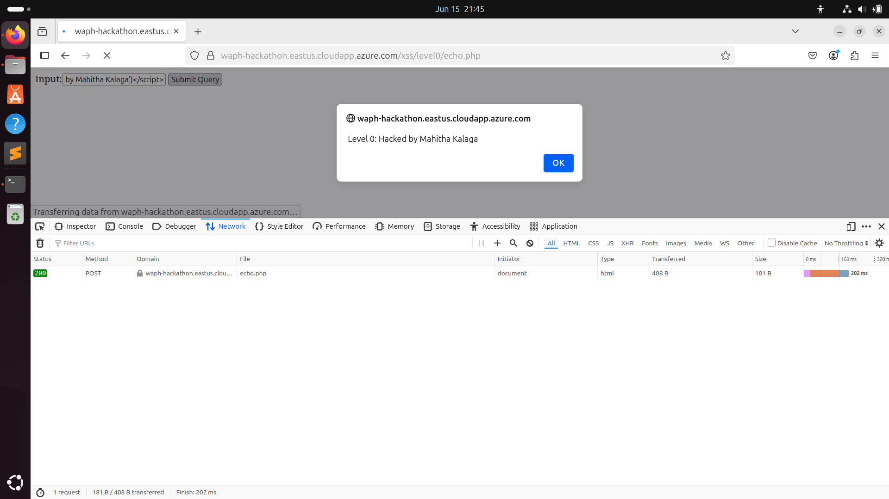

### Level 1: 

The input was reflected inside an attribute, so I broke out using "script.../script. This triggered the alert, proving the vulnerability exists in unescaped attribute context.

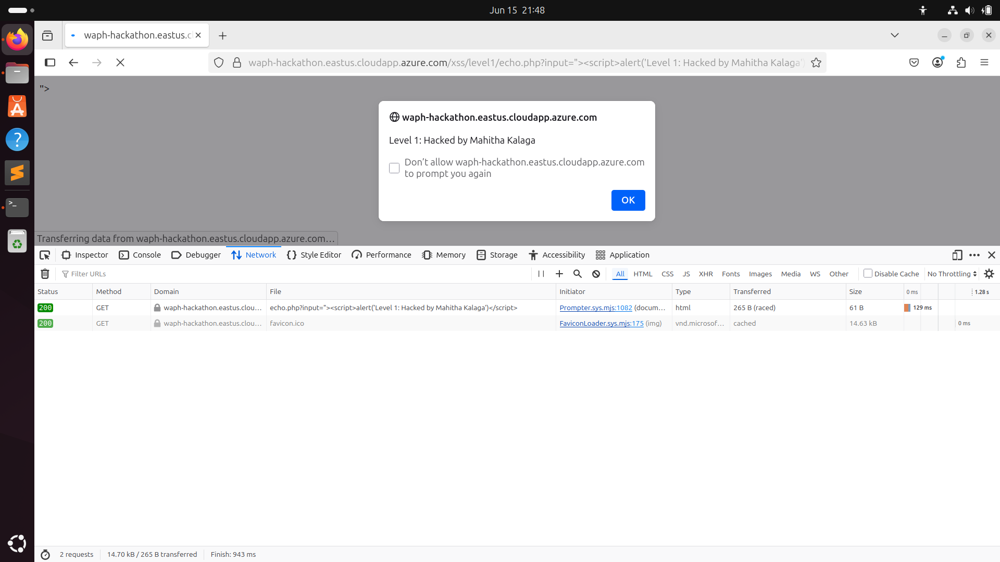

### Level 2: 

The input was submitted via POST by creating level.html, and the server echoed it without filtering. Using a standard script payload in the form triggered the alert, showing direct use of $_POST["input"].

  - Payload: scriptalert("Level 2: Hacked by Mahitha Kalaga")/script
  - Input Method: Submitted via POST
  - Code Guess: echo $_POST["input"];

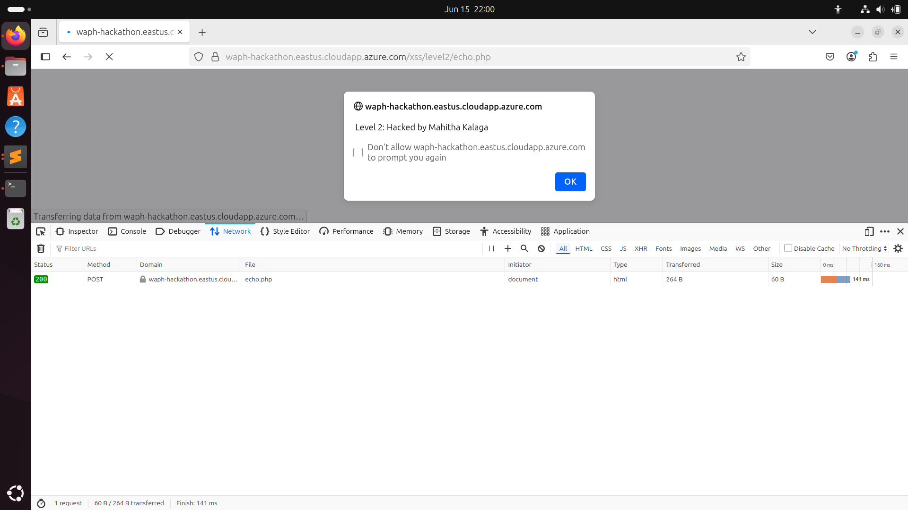

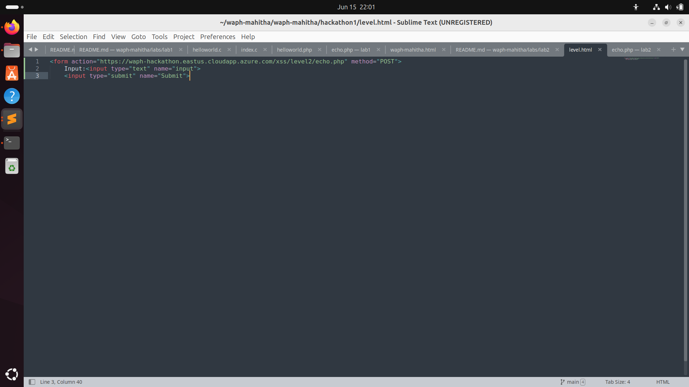

### Level 3: 

The script tag was filtered, so I used img src=x onerror=... to trigger JavaScript via an event. The alert showed my message, confirming that only script tags were stripped, not event handlers.

  - Payload: img src=x onerror="alert('Level 3: Hacked by Mahitha Kalaga')
  - Code Guess: echo str_replace("script", "", $_GET["input"]);

### Level 4: 

I used the details HTML tag with the ontoggle event to trigger the alert. The payload successfully executed and displayed the message “Level 4: Hacked by Mahitha Kalaga”. This confirms the application only filters specific tags like script but still allows dangerous event attributes.

  - Payload: details open ontoggle="alert('Level 4: Hacked by Mahitha Kalaga')"
  - Code Guess: echo str_ireplace("script", "", $_GET["input"]);

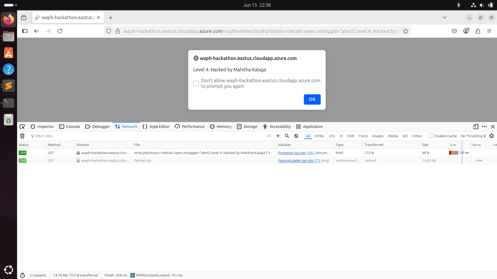

### Level 5: 

Since keywords like alert and script were filtered in Level 5, I bypassed detection using a harmless-looking  tag with a console.log() payload. The attack succeeded, and the message “Level 5: Hacked by Mahitha Kalaga” was printed in the browser console. This confirms that the input is still executed in the browser context, even though the output is sanitized for visible scripts.

  - Payload: img src=x onerror="console.log('Level 5: Hacked by Mahitha Kalaga')"
  - Code Guess: $input = $_GET["input"];
                         $input = str_ireplace(["script", "alert"], "", $input);
                         echo $input;

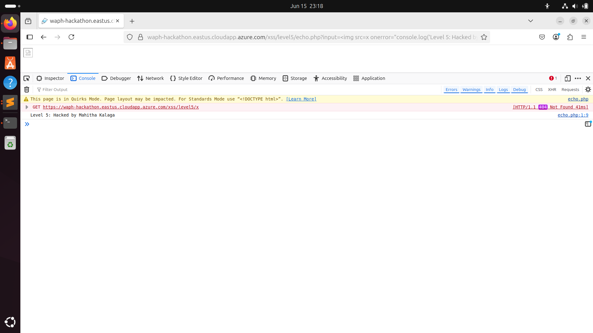

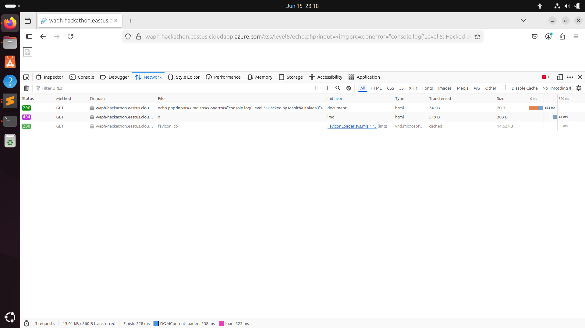

### Level 6: 

Level 6 was designed to escape special characters, using htmlentities(). Despite that, I successfully injected a working script tag via URL, and the alert “Level 6: Hacked by Mahitha Kalaga” was displayed. This indicates that the server-side encoding was either bypassed or not enforced properly in all contexts.

  - Payload: scriptalert("Level 6: Hacked by Mahitha Kalaga")/script
  - Code Guess: echo htmlentities($_POST["input"]);

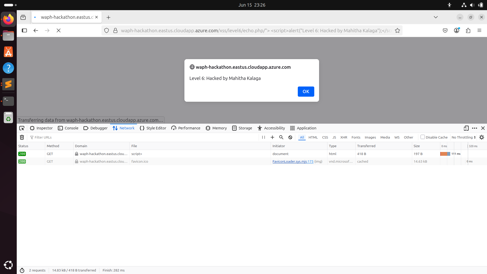

### Task 2: Defenses

### Task 2.1: Lab 1 - echo.php XSS Defense

 - Escaped user inputs using htmlspecialchars() to prevent JavaScript injection.
 - Applied basic input validation to accept only alphanumeric characters and limited symbols.

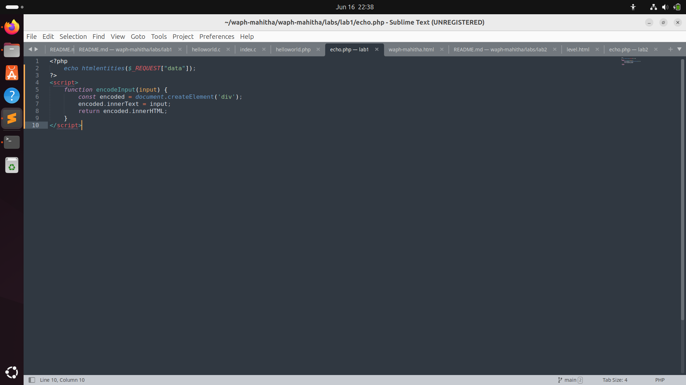

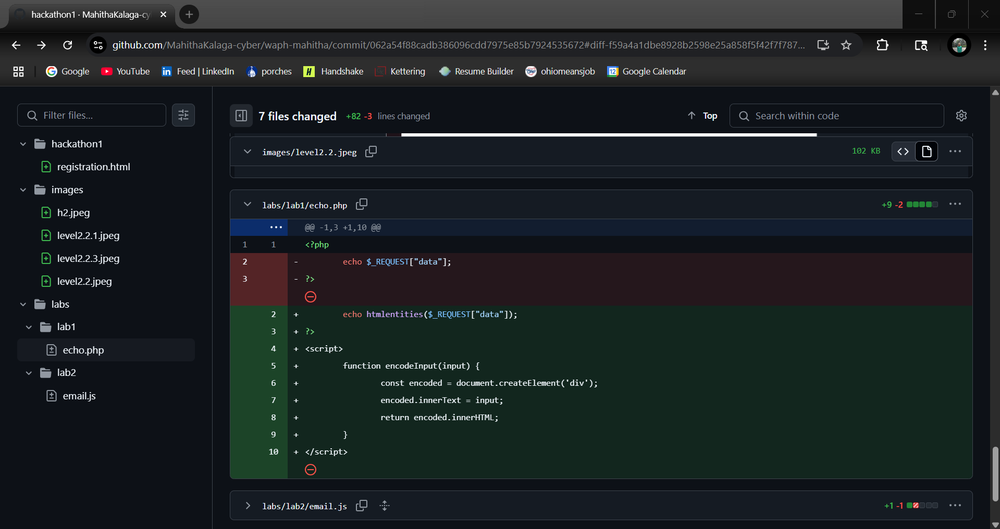

### Task 2.2: Lab 2 - Front-End Prototype XSS Defenses

Secure front-end user registration form using HTML, jQuery, and JavaScript. The form included username, password, and confirm password input fields where client-side validation was done through input patterns and regular expressions. A password policy was used to require a mix of upper and lower case, digits, and special characters. JavaScript event handlers were used to check password strength dynamically and confirm matching. To avoid reflected XSS attacks, user input was sanitized by calling a custom sanitizeInput() function before it was rendered in the DOM.

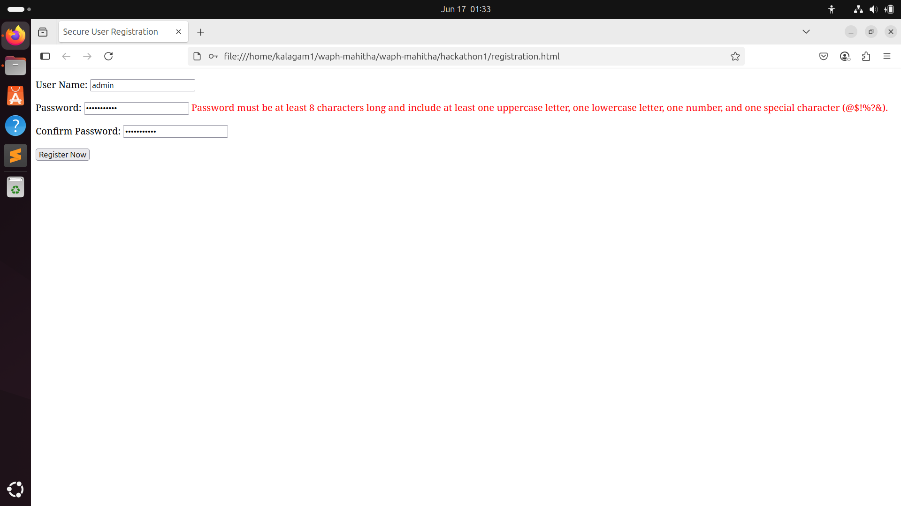

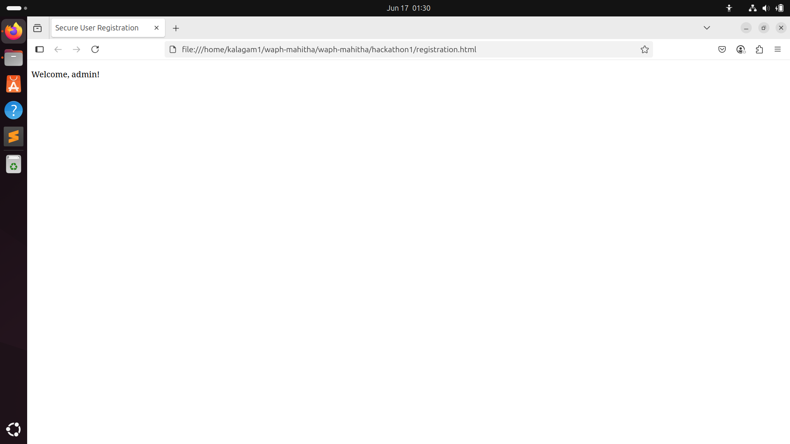

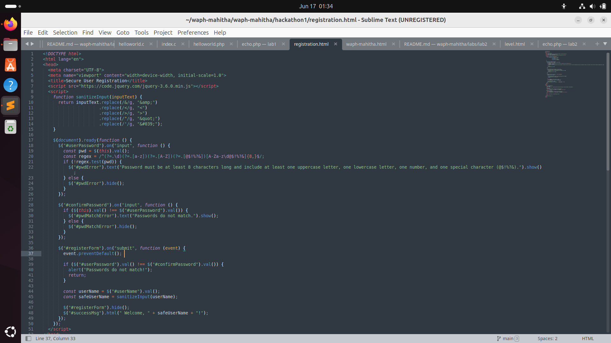

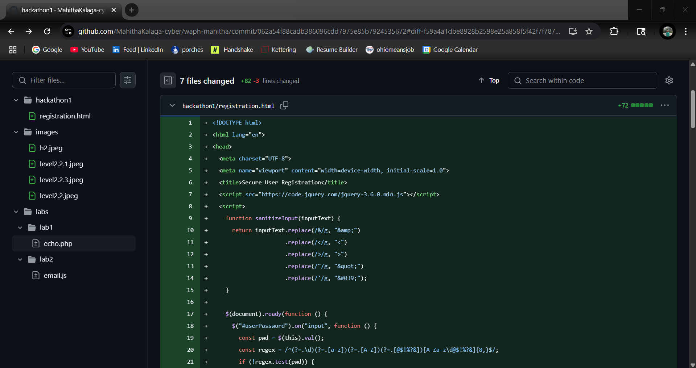
