# Web Application Programming and Hacking

## Instructor: Dr. Phu Phung

## Student

**Name**: Mahitha Kalaga

**Email**: [kalagam1@udayton.edu](kalagam1@udayton.edu)

## Repository Information

Repository's URL: [https://github.com/kalagam1/waph-kalagam1.git](https://github.com/kalagam1/waph-kalagam1.git)

This is a private repository for Mahitha Kalaga to store all the code from the course. The organization of this repository is as follows.

### Labs

[Hands-on exercises in Lectures](labs)

- [Lab 0](labs/lab0): Development Environment Setup
- [Lab 1](labs/lab1): Foundations of the Web
- [Lab 2](labs/lab2): Front-end Web Development
- [Lab 3](labs/lab3): Secure Web Application Development in PHP/MySQL

### Hackathons

- [Hackathon 1](hackathon1): Cross-site Scripting Attacks and Defenses
- [Hackathon 2](hackathon2): SQL Injection Attacks

### Individual Projects

- [Individual Project 1](https://github.com/kalagam1/kalagam1.github.io): Front-end Web Development with a Professional Profile Website and API Integration on github.io cloud service

## Report

## The Hackathon's overview

In Hackathon 2 for the Web Application Programming and Hacking course, I explored various levels of SQL injection (SQLi) vulnerabilities to understand how attackers can exploit insecure web applications. The first two levels involved bypassing login pages using crafted SQL payloads—initially with single quotes and later with double quotes—highlighting differences in backend SQL handling. The third level focuses on vulnerabilities in URL parameters. By injecting SQL code directly into the URL, I was able to identify the number of database columns, display custom information, retrieve the full database schema, and extract login credentials. After decrypting hashed passwords using online MD5 tools, I successfully logged into the system with stolen credentials.

Hackathon's URL: [Hackathon](https://github.com/kalagam1/waph-kalagam1/tree/main/hackathon2)

## Task 1: 

### Level 0: Basic SQL Injection

I accessed a basic login page and performed a simple SQL injection attack to bypass authentication. By entering the payload kalagam1’ OR ‘1’=’1’;# into the username field, I was able to manipulate the SQL query so that it always returned true, regardless of the actual credentials. This demonstrated a common vulnerability where user inputs are not properly sanitized, allowing attackers to gain unauthorized access simply by injecting SQL logic into form fields.

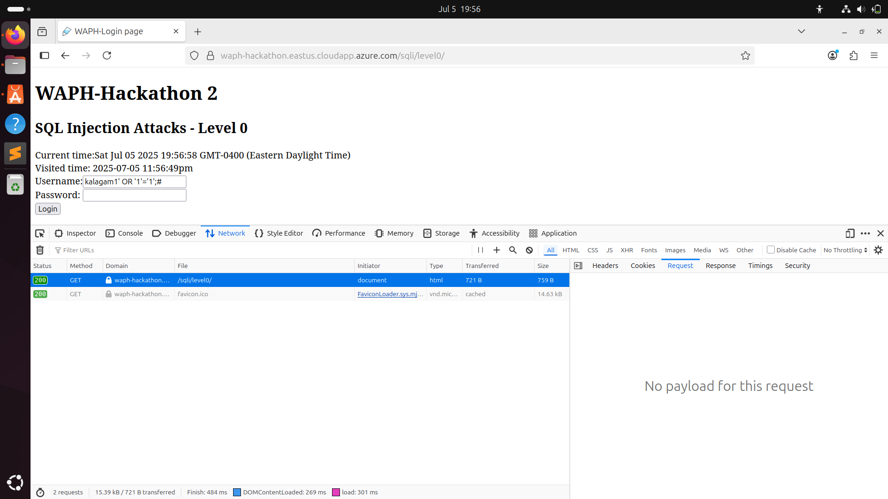

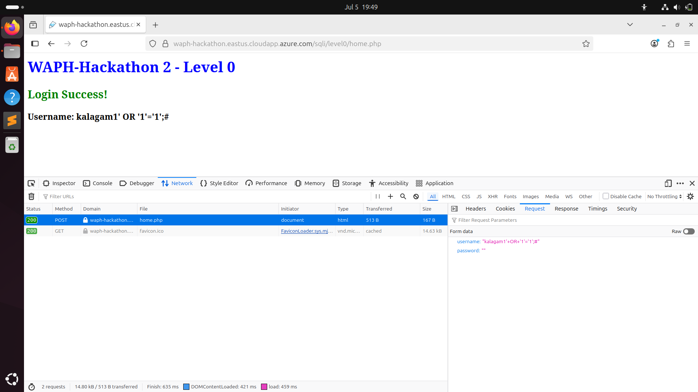

### Level 1: Modified Injection Technique

After some testing and error analysis, I successfully bypassed the login by using the payload kalagam1" OR "1"="1" LIMIT 1;#. This allowed me to log in without valid credentials by exploiting the structure of the SQL query. It also confirmed that understanding how backend queries are written—such as the use of single or double quotes—is critical when crafting effective SQL injections. 

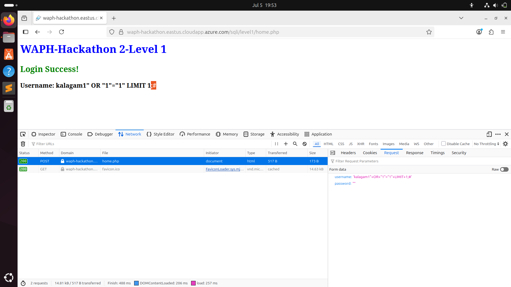

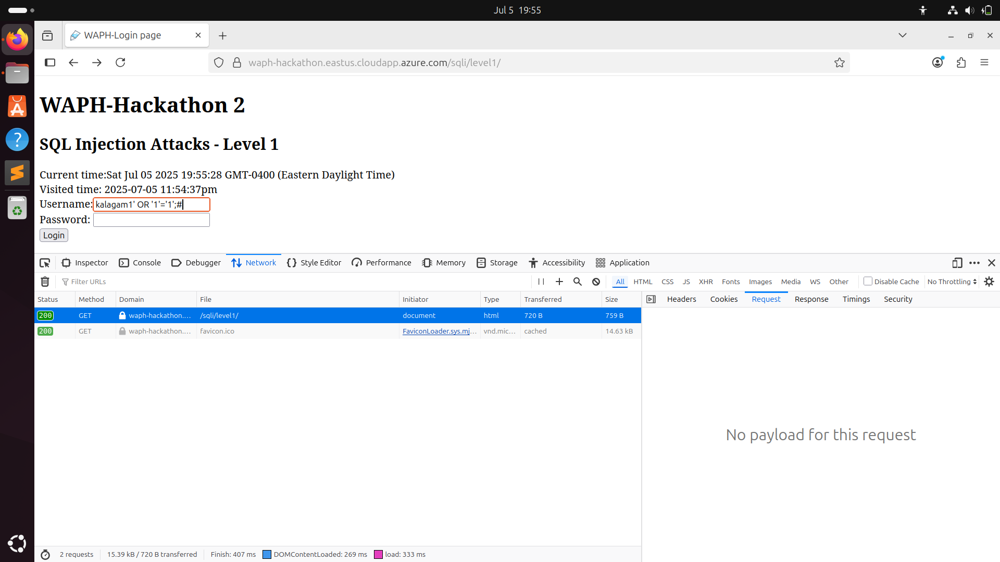

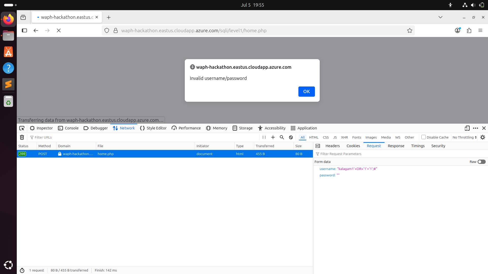

### Level 2: Advanced SQL Injection and Data Extraction

#### A. Detecting SQL Injection Vulnerabilities

I explored the application to identify potential SQL injection points. While the login form was secure, I found that the id parameter in the product page URLs (such as for "apple" or "pear") was vulnerable. By injecting SQL statements directly into the URL using UNION SELECT, I was able to confirm that the backend was executing the injected SQL and returning the results. This revealed that the URL was the primary attack surface, making it a critical vulnerability that could expose database data if not properly handled.

Injecting SQL statements like SELECT and UNION into the URL successfully returned data. For example: .../product.php?id=1 UNION SELECT 1,2

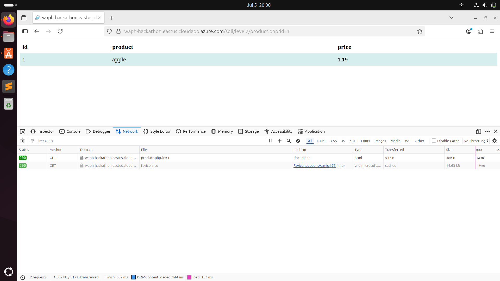

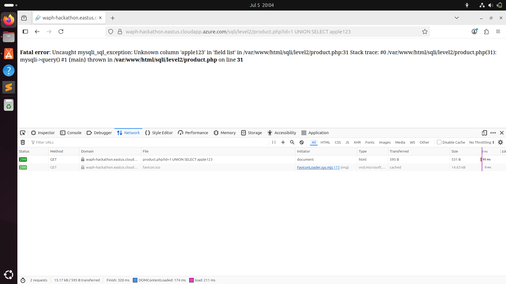

The error response helped determine how many columns are expected.

#### B. Exploiting the Vulnerability

i. Identifying the Number of Columns

To determine how many columns were expected in the backend query, I used trial-and-error with different UNION SELECT statements. Starting with two columns (1,2) triggered an error, so I increased the number of selected values until the injection succeeded with three columns. This confirmed that the SQL query used in the application’s backend was pulling data from three columns, which was essential for crafting successful payloads in later steps. This payload worked: .../product.php?id=1 UNION SELECT 1,2,3

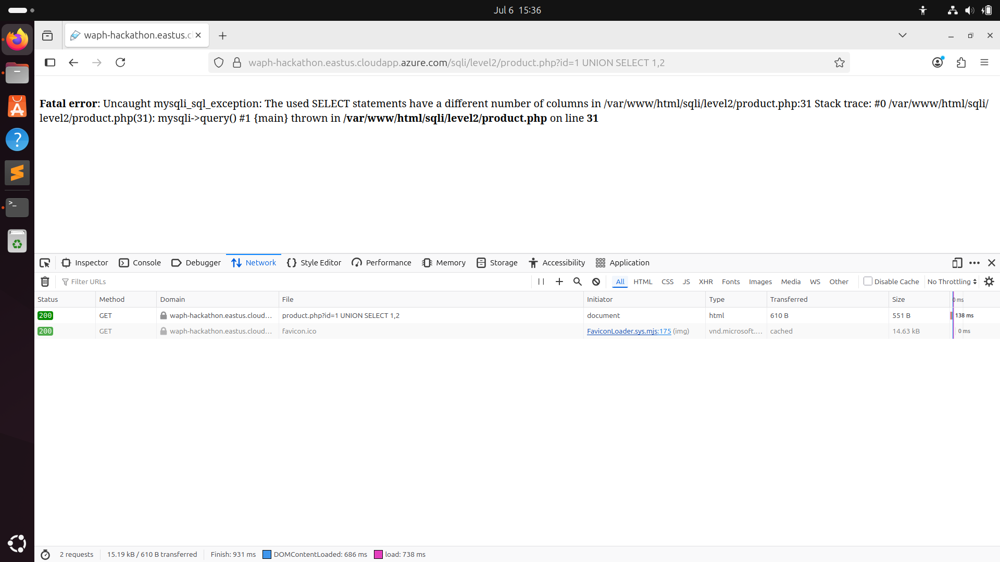

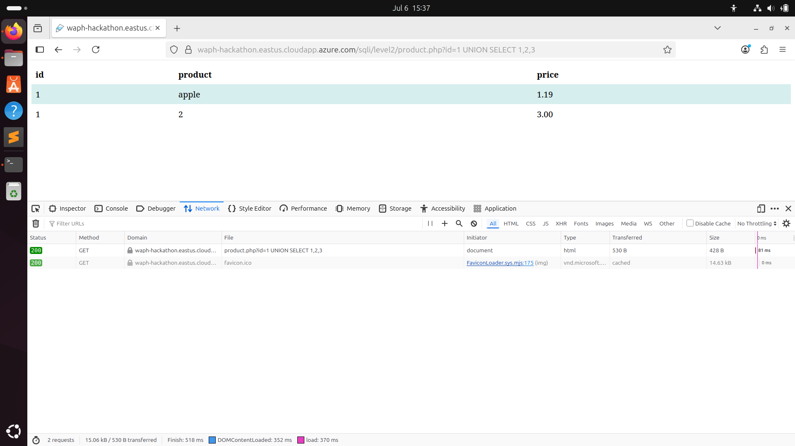

ii. Displaying Custom Information

After identifying the correct number of columns, I crafted a UNION SELECT payload to display my own details on the web page. I inserted my username, full name, and section into the respective columns using the payload:
.../product.php?id=1 UNION SELECT "kalagam1", "Mahitha", "M6"
The application reflected this data on the page, proving that arbitrary user-controlled input could be injected and displayed, reinforcing the severity of the vulnerability.

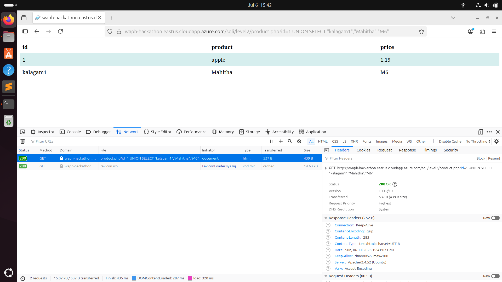

This allowed me to display my name, username, and section in the page.

iii. Revealing the Database Schema

I attempted to retrieve metadata about the database by querying the information_schema.columns table. I used a UNION SELECT payload to extract table and column names, while placing a custom string (Hacked by kalagam1) in the third column. This payload allowed me to view the underlying structure of the database, which included sensitive tables such as those containing login credentials. To view table and column names from the database, I used: .../product.php?id=0 UNION SELECT table_name, column_name, 'Hacked by kalagam1' FROM information_schema.columns

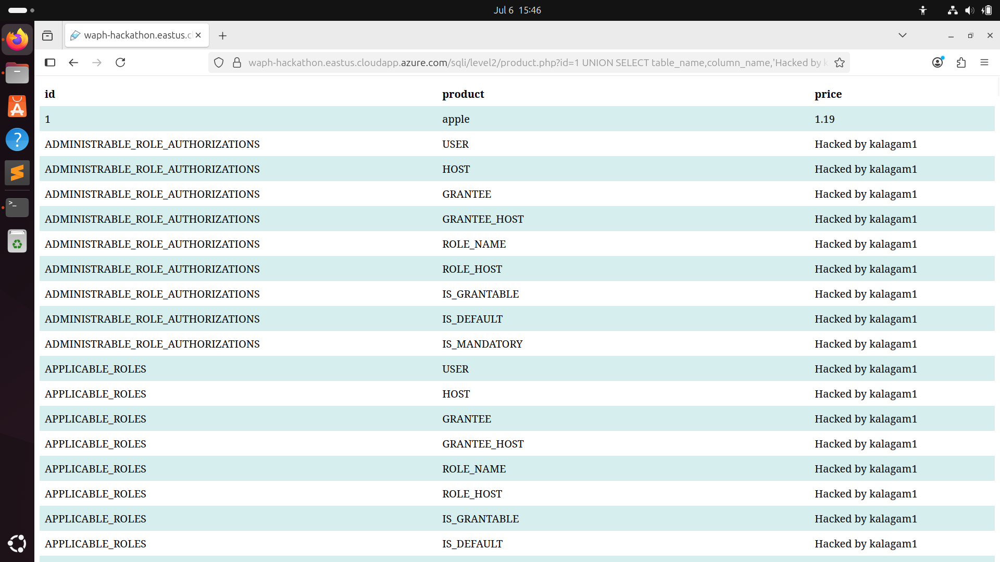

This revealed full database structure, including login-related tables.

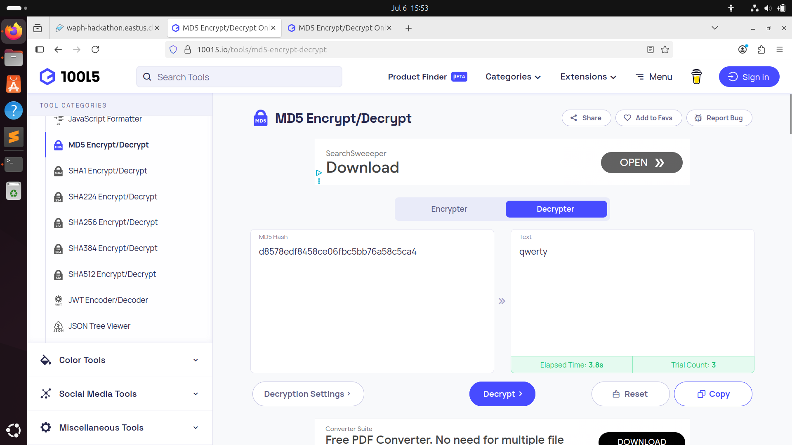

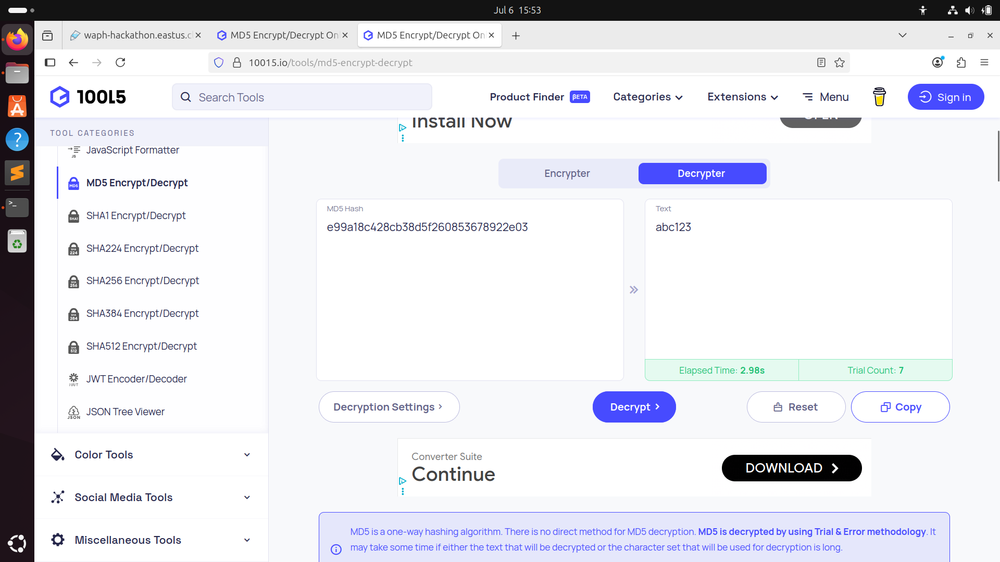

iv. Extracting Login Credentials

I targeted the login table to extract actual user credentials. Using another UNION SELECT statement, I retrieved login names and MD5-hashed passwords. I then decrypted these hashes using publicly available online tools to recover the plaintext passwords (e.g., qwerty, abc123). This showed how SQL injection could escalate from basic data exposure to full credential theft. To fetch actual credentials from the login table, I used: .../product.php?id=0 UNION SELECT loginname, password, 'Hacked by kalagam1' FROM login

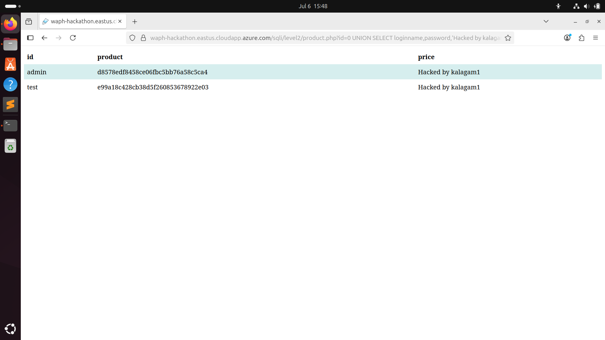

#### C. Logging In with Stolen Credentials

I used the decrypted login credentials obtained in the previous step to log into the system through the regular interface. The login was successful, confirming that the stolen data was valid and proving that the SQL injection vulnerability could lead to complete account compromise and unauthorized access to user accounts.

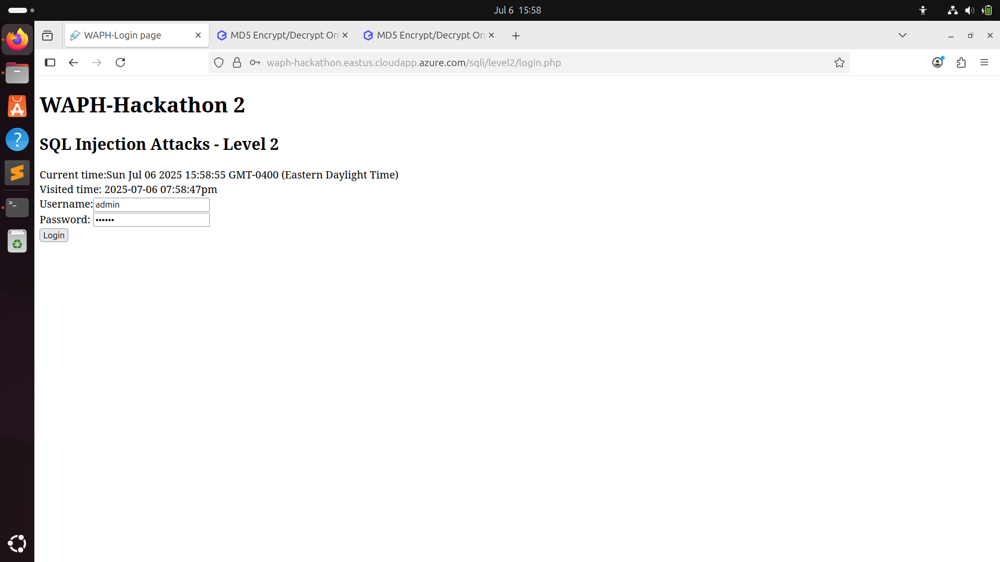

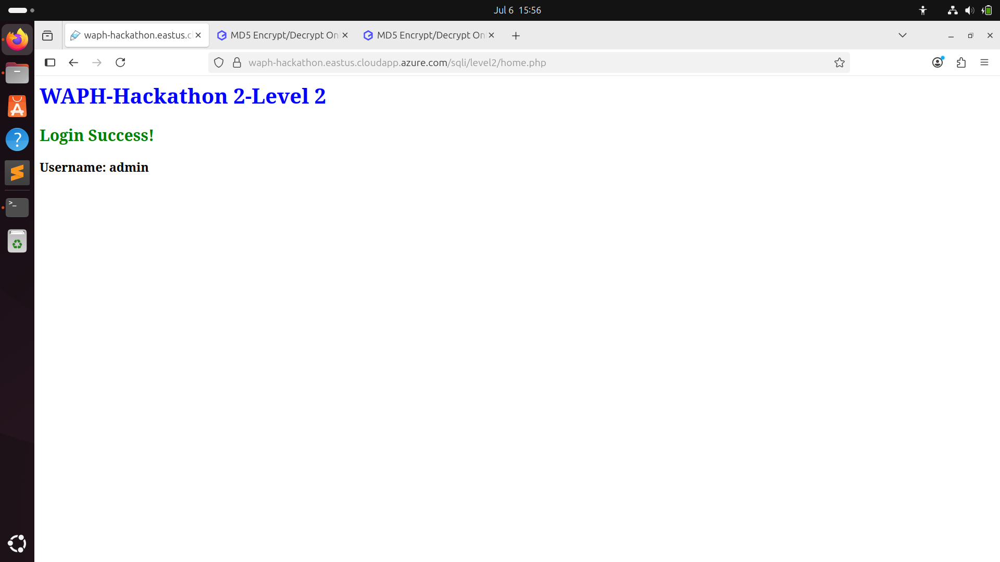

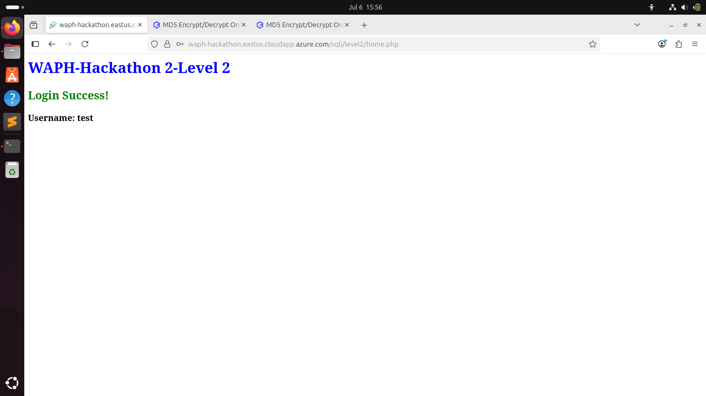
