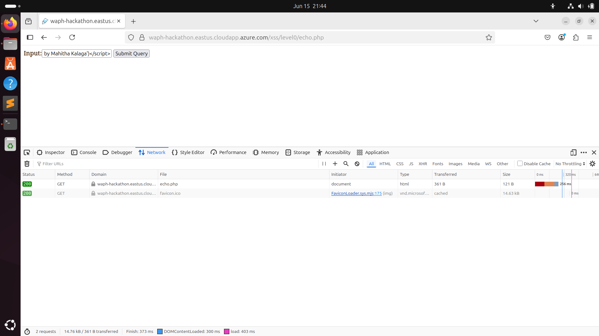
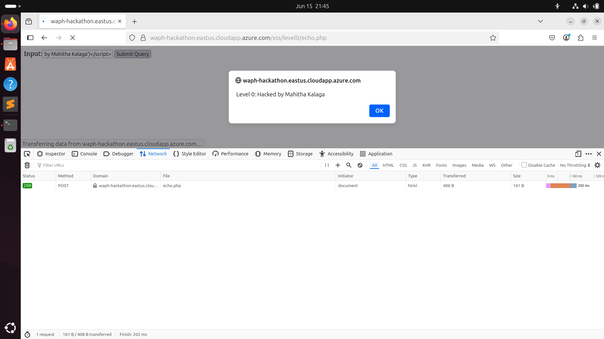
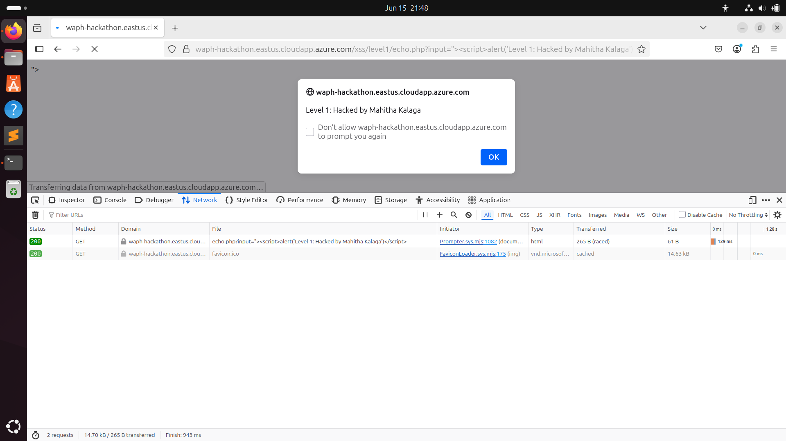
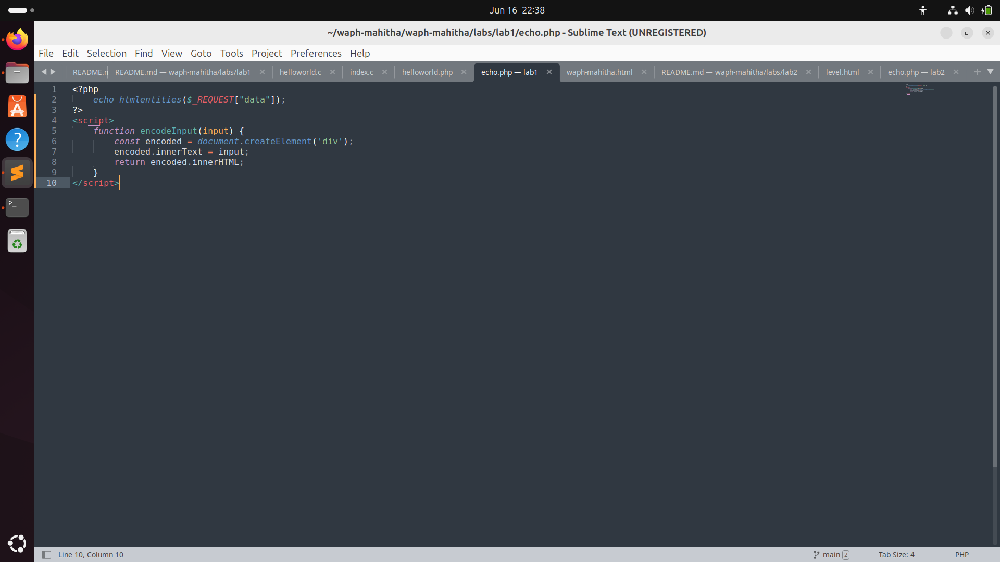
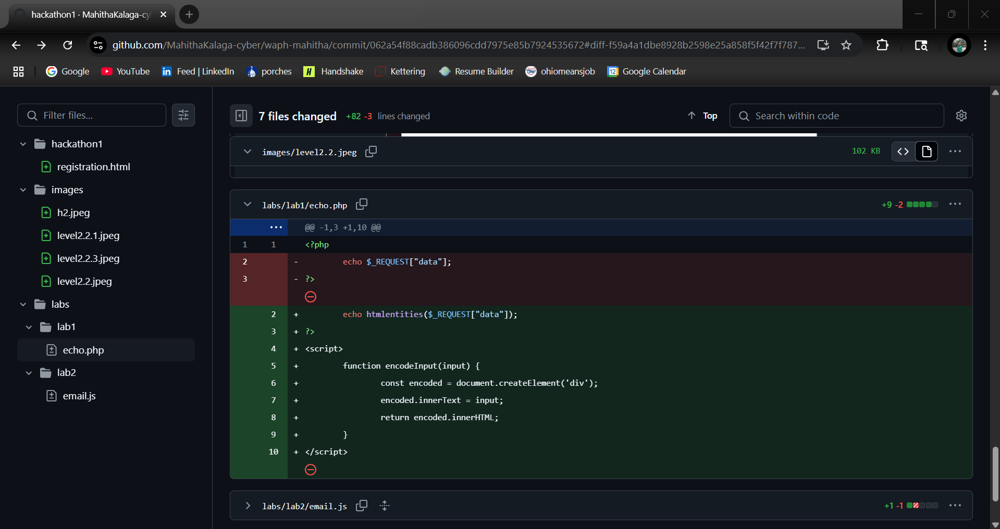

# Web Application Programming and Hacking

## Instructor: Dr. Phu Phung

## Student

**Name**: Mahitha Kalaga

**Email**: [kalagam1@udayton.edu](kalagam1@udayton.edu)

## Repository Information

Repository's URL: [https://github.com/kalagam1/waph-kalagam1.git](https://github.com/kalagam1/waph-kalagam1.git)

This is a private repository for Mahitha Kalaga to store all the code from the course. The organization of this repository is as follows.

### Labs

[Hands-on exercises in Lectures](labs)

- [Lab 0](labs/lab0): Development Environment Setup
- [Lab 1](labs/lab1): Foundations of the Web
- [Lab 2](labs/lab2): Front-end Web Development
- [Lab 3](labs/lab3): Secure Web Application Development in PHP/MySQL

### Hackathons

- [Hackathon 1](hackathon1): Cross-site Scripting Attacks and Defenses
- [Hackathon 2](hackathon2): SQL Injection Attacks

### Individual Projects

- [Individual Project 1](https://github.com/kalagam1/kalagam1.github.io): Front-end Web Development with a Professional Profile Website and API Integration on github.io cloud service

## Report

## The Hackathon's overview

This hackathon focused on identifying and exploiting reflected Cross-Site Scripting (XSS) vulnerabilities through a series of hands-on web security exercises. Covered in Lectures 7 and 8, the hackathon included two tasks: performing XSS attacks across seven levels of increasing difficulty, and implementing proper defenses in insecure web applications from Lab 1 and Lab 2.

Hackathon's URL: [Hackathon](https://github.com/kalagam1/waph-kalagam1/tree/main/hackathon2)

## Task 1: Attacks

In this task, I performed reflected XSS attacks on levels 0 to 6 by injecting custom payloads to display messages like "Hacked by Mahitha Kalaga". For each level, I bypassed filters using different techniques such as using image tags, obfuscated scripts, and DOM manipulation, and identified the likely vulnerable PHP code behind each level.

### Level 0: Basic SQL Injection

I used a basic SQL injection technique to bypass authentication. In the username field, I entered the following payload: kalagam1’ OR ‘1’=’1’;#

This worked because the injected SQL always returns true, effectively bypassing login and granting access. I confirmed this through the page’s response and also checked the payload using browser developer tools.

### Level 1: Modified Injection Technique

To bypass it, I used: kalagam1" OR "1"="1" LIMIT 1;#

The login succeeded with this input, confirming that the SQL query behind the scenes uses double quotes for the username field.

### Level 2: Advanced SQL Injection and Data Extraction

#### a. Detecting SQL Injection Vulnerabilities

The page contains three links—apple, pear, and login. The login form is protected against SQLi, but the URL parameter (id) in the apple/pear links is vulnerable.

Injecting SQL statements like SELECT and UNION into the URL successfully returned data. For example: .../product.php?id=1 UNION SELECT 1,2

The error response helped determine how many columns are expected.

#### b. Exploiting the Vulnerability

i. Identifying the Number of Columns

By trial and error, I determined that the backend query expects three columns. This payload worked: .../product.php?id=1 UNION SELECT 1,2,3

ii. Displaying Custom Information

I replaced the columns with my own data: .../product.php?id=1 UNION SELECT "kalagam1", "Mahitha", "M6"

This allowed me to display my name, username, and section in the page.

iii. Revealing the Database Schema

To view table and column names from the database, I used: .../product.php?id=0 UNION SELECT table_name, column_name, 'Hacked by kalagam1' FROM information_schema.columns

This revealed full database structure, including login-related tables.

iv. Extracting Login Credentials

To fetch actual credentials from the login table, I used: .../product.php?id=0 UNION SELECT loginname, password, 'Hacked by kalagam1' FROM login

The result showed usernames and hashed passwords (in MD5 format). I used online MD5 decryption tools to crack them and found passwords like qwerty and abc123.

#### c. Logging In with Stolen Credentials

Using the recovered login details, I successfully accessed the system, proving that the SQL injection allowed unauthorized access to user data and authentication.

