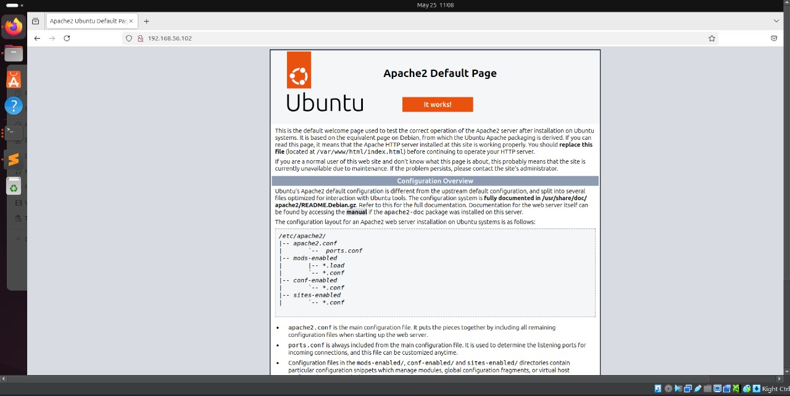
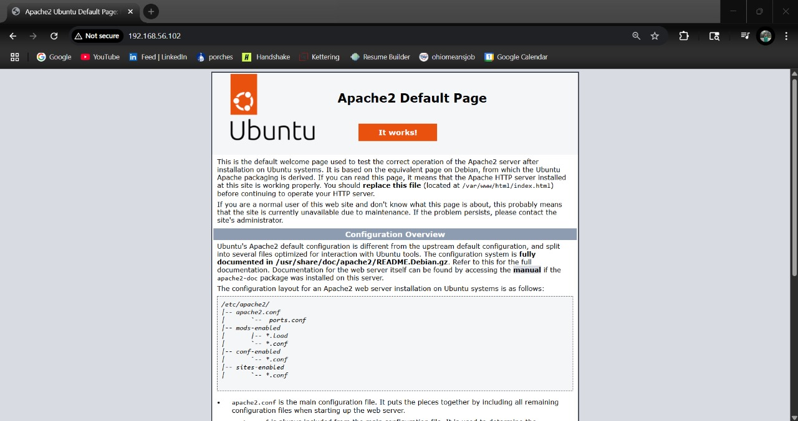

# Web Application Programming and Hacking

## Instructor: Dr. Phu Phung

## Student

**Name**: Mahitha Kalaga

**Email**: [kalagam1@udayton.edu](kalagam1@udayton.edu)

## Repository Information

Repository's URL: [https://github.com/MahithaKalaga-cyber/waph-mahitha.git](https://github.com/MahithaKalaga-cyber/waph-mahitha.git)

This is a private repository for Mahitha Kalaga to store all code from the course. The organization of this repository is as follows.

### Labs

[Hands-on exercises in Lectures](labs)

- [Lab 0](labs/lab0): Development Environment Setup

## Report

## The lab's overview

This lab focused on setting up the development environment for WAPH. In Part I, I installed Ubuntu 22.04 in VirtualBox and configured the system with essential packages. In Part II, I cloned both the public course repository and my private GitHub repository, and completed git-related tasks.

Lab's URL: [Lab0](https://github.com/MahithaKalaga-cyber/waph-mahitha/tree/main/labs/lab0)

## Part 1 -  Ubuntu Virtual Machine & Software Installation

Created a new VirtualBox VM using the Ubuntu 22.04 ISO and allocated 4 GB RAM and 2 CPUs. After the OS was installed, I set up the following:

- Installed system updates
- Installed Apache2, Git, and Sublime Text
- Installed Google Chrome manually via .deb package
- Installed Wireshark and configured non-root access

### Apache Web Server Testing

## Part 2 - git Repositories and Exercises

### The couse repository

### Private Repository

