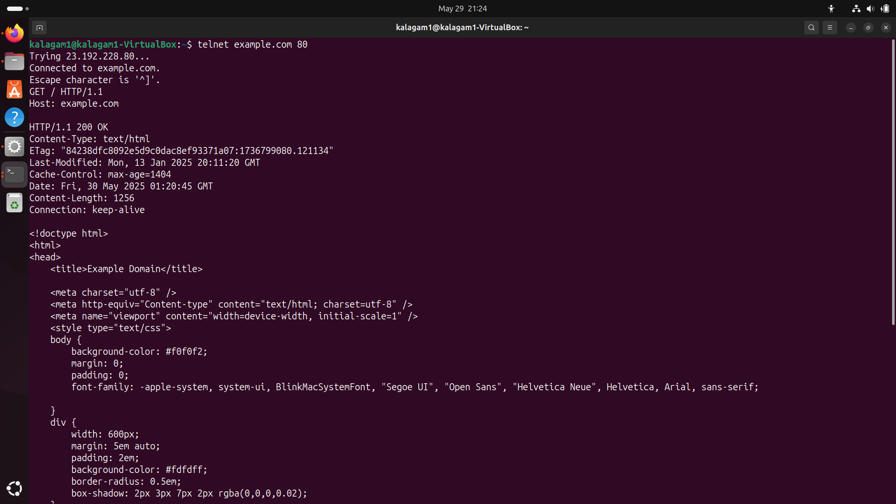
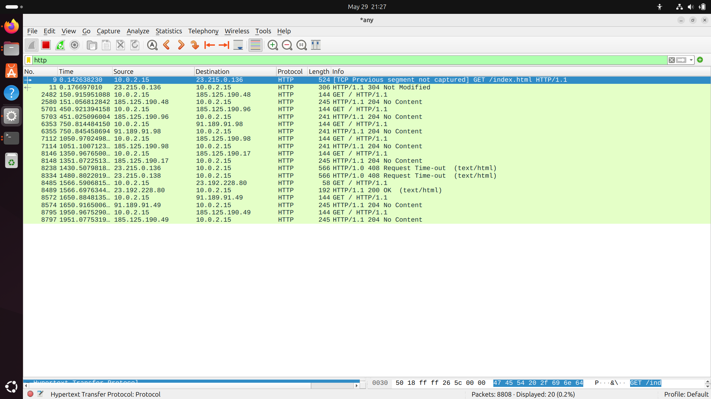
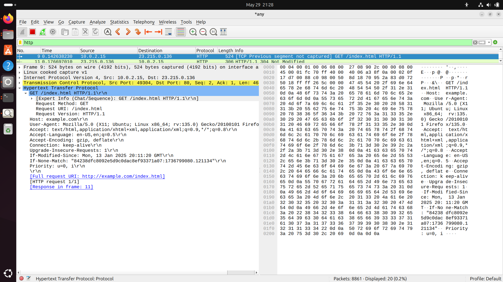

# Web Application Programming and Hacking

## Instructor: Dr. Phu Phung

## Student

**Name**: Mahitha Kalaga

**Email**: [kalagam1@udayton.edu](kalagam1@udayton.edu)

## Repository Information

Repository's URL: [https://github.com/MahithaKalaga-cyber/waph-mahitha.git](https://github.com/MahithaKalaga-cyber/waph-mahitha.git)

This is a private repository for Mahitha Kalaga to store all the code from the course. The organization of this repository is as follows.

### Labs

[Hands-on exercises in Lectures](labs)

- [Lab 0](labs/lab0): Development Environment Setup
- [Lab 1](labs/lab1): Foundations of the Web

## Report

## The lab's overview

This lab focused on understanding how the web works, specifically the HTTP protocol, and creating basic web applications using CGI in C and PHP. The main outcomes included:

 - Capturing and analyzing HTTP traffic with Wireshark.
 - Sending HTTP requests using telnet.
 - Writing and deploying CGI programs in C.
 - Developing simple PHP applications that handle GET and POST requests.

Lab's URL: [Lab1](https://github.com/MahithaKalaga-cyber/waph-mahitha/tree/main/labs/lab1)

## Part 1 - The Web and HTTP Protocol

### Task 1: Familiar with the Wireshark Tool and HTTP Protocol

I used Wireshark to monitor browser activity and filter HTTP traffic. I was able to capture the HTTP request and response headers and analyze the HTTP stream.

### Task 2: Understanding HTTP using Telnet and Wireshark

I used the telnet command to send an HTTP GET request to a server manually. Wireshark was used to capture and inspect these messages.

#### Summary:

The telnet session displayed a manual HTTP request and the server's response.

Compared to browser-generated requests, telnet requests were minimal and lacked headers like User-Agent.

The response message lacked formatting compared to browser responses.

 - This shows that the GET request and the HTTP request 200 OK response with the HTML content from the server. 

Comparison with browser-based request:

 - The telnet request is simpler and lacks headers like:

  - User-Agent
  - Accept
  - Accept-Encoding
  - Connection

 - It only includes GET / HTTP/1.1 and Host.

Comparison with Task 1 response:

 - The content is the same, but some headers like Content-Encoding, ETag,  may vary depending on how the request was formed telnet vs browser.

## Part 2 - Basic Web Application Programming

### Task 1: CGI Web Applications in C

### a. Hello World Program

I wrote a simple C program that prints HTTP headers and a message. Compiled using gcc and placed in the cgi-bin directory.

### b. HTML Template with CGI

Created another C CGI program that outputs HTML content. I embedded the output in a basic HTML template.

### Task 2: A Simple PHP Web Application with User Input

### a. Hello World in PHP

Created a helloworld.php file that shows my name and PHP info using phpinfo().

### b. Echo Web Application

Developed echo.php that captures user input using GET and POST methods. This application echoes the submitted data.

### Task 3: Understanding HTTP GET and POST Requests

### a. Wireshark GET Analysis

Used Wireshark to capture and analyze the GET request/response for echo.php.

### b. curl POST Request

Used curl -d "name=Mahitha" http://localhost/echo.php to send a POST request.

### c. Comparison

