# Web Application Programming and Hacking

## Instructor: Dr. Phu Phung

## Student

**Name**: Mahitha Kalaga

**Email**: [kalagam1@udayton.edu](kalagam1@udayton.edu)

## Repository Information

Repository's URL: [https://github.com/kalagam1/waph-kalagam1.git](https://github.com/kalagam1/waph-kalagam1.git)

This is a private repository for Mahitha Kalaga to store all the code from the course. The organization of this repository is as follows.

### Labs

[Hands-on exercises in Lectures](labs)

- [Lab 0](labs/lab0): Development Environment Setup
- [Lab 1](labs/lab1): Foundations of the Web
- [Lab 2](labs/lab2): Front-end Web Development
- [Lab 3](labs/lab3): Secure Web Application Development in PHP/MySQL
- [Lab 4](labs/lab4): A Secure Login System with Session Authentication
### Hackathons

- [Hackathon 1](hackathon1): Cross-site Scripting Attacks and Defenses
- [Hackathon 2](hackathon2): SQL Injection Attacks

### Individual Projects

- [Individual Project 1](https://github.com/kalagam1/kalagam1.github.io): Front-end Web Development with a Professional Profile Website and API Integration on github.io cloud service

## Report

## The lab's overview

This lab focused on developing secure web applications using PHP and MySQL, emphasizing protection against SQL injection and XSS attacks. Tasks included setting up a MySQL database, creating user tables with hashed passwords, building a basic login system, performing injection attacks, and securing the application using prepared statements and input/output sanitization. Through this lab, I gained hands-on experience in both exploiting and defending against common web vulnerabilities.

Lab's URL: [Lab3](https://github.com/kalagam1/waph-kalagam1/tree/main/labs/lab3)

## Part 1 - Database Setup and Management

#### Task 1.A: MySQL Installation 

I installed the MySQL server on my virtual machine using the command sudo apt-get install mysql-server -y. After installation, I verified the version using 'mysql -V' and confirmed that it was functioning correctly. I then connected to the MySQL server using sudo mysql -u root -p, which allowed me to proceed with creating and managing databases.

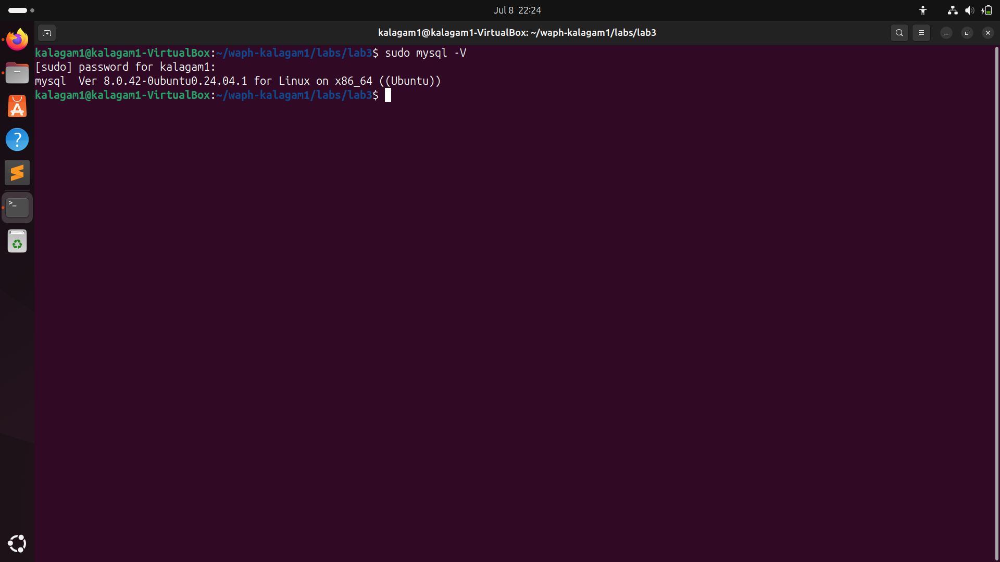

#### Task 1.B: Create a New Database, Database User, and Permission 

After installing MySQL, I created a script named database-account.sql, which contained SQL statements to create a new database, add a user, and assign all necessary privileges. I executed this script from within the MySQL prompt using the SOURCE command. The execution successfully created the database and user account, and confirmed that the user had the appropriate permissions.

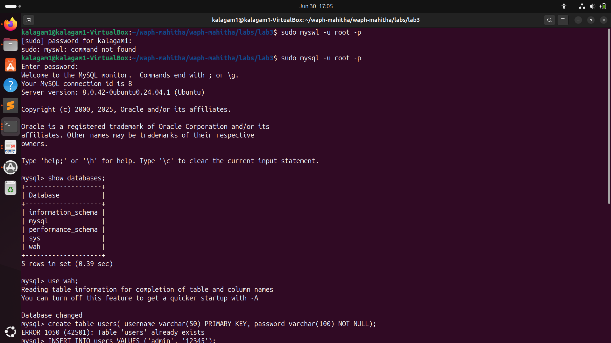

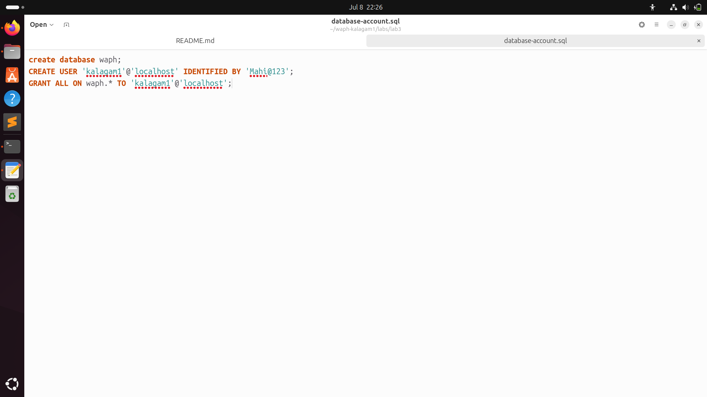

#### Task 1.C: Create a New Table Users and Insert Data into the Table

To store user data, I created another SQL script named database-data.sql, which defined a Users table with username and password fields. I inserted a test user (kalagam1) with the password, which was hashed using the MD5 function for basic encryption. After executing this script, I used the query SELECT * FROM Users; to verify that the data was stored correctly. I also demonstrated logging into MySQL as the new user (non-root) and displayed the table contents to confirm proper database setup.

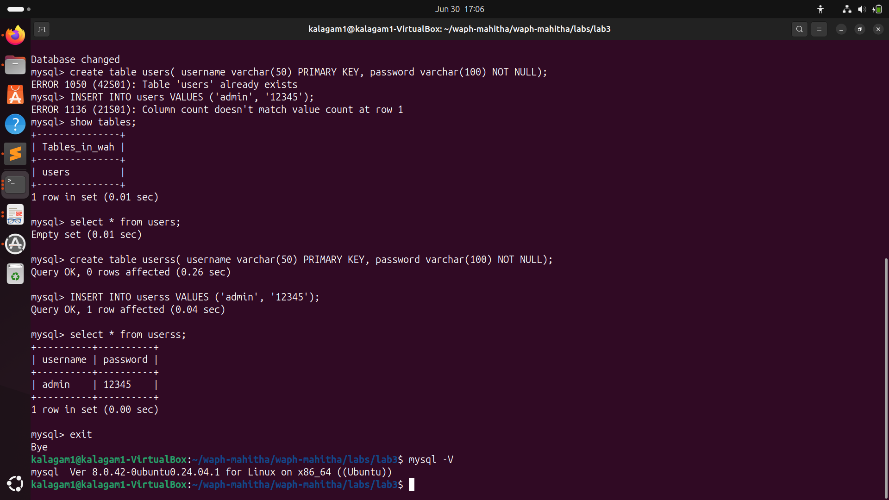

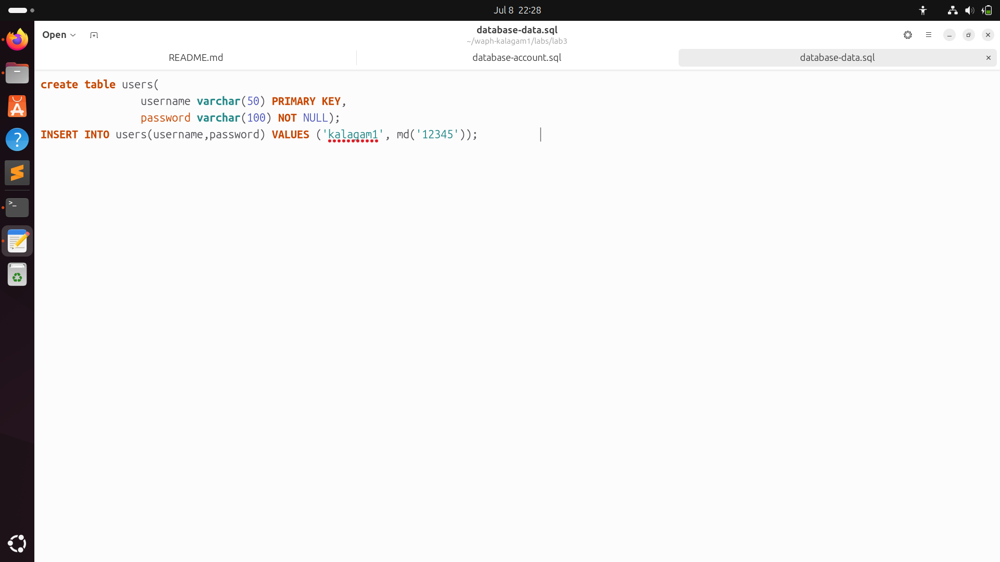

### Task 2: A Simple (Insecure) Login System with PHP/MySQL

To create the login system, I installed the PHP MySQLi extension using sudo apt-get install php-mysqli and restarted the Apache server with sudo service apache2 restart to apply the changes. Once the environment was ready, I modified the index.php file to include a checklogin_mysql function that used direct SQL queries to validate user credentials. This function connected to the database, retrieved the username and password from POST data, and checked for a match.

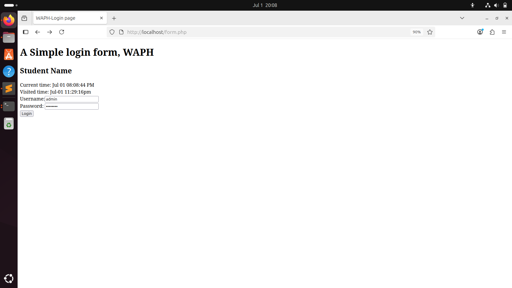

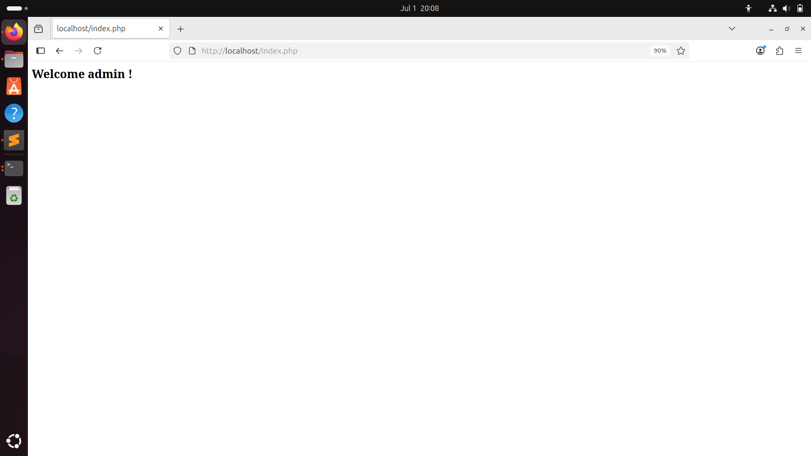

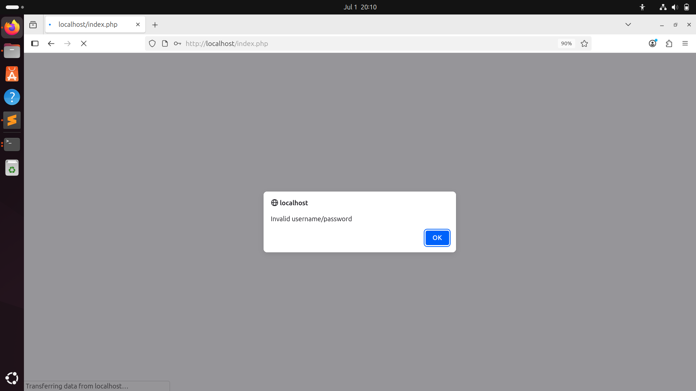

For deployment, I copied index.php and form.php into the /var/www/html directory and accessed the web application through a browser. When valid login credentials were entered, the user was successfully authenticated. Invalid login attempts were rejected with an appropriate error message.

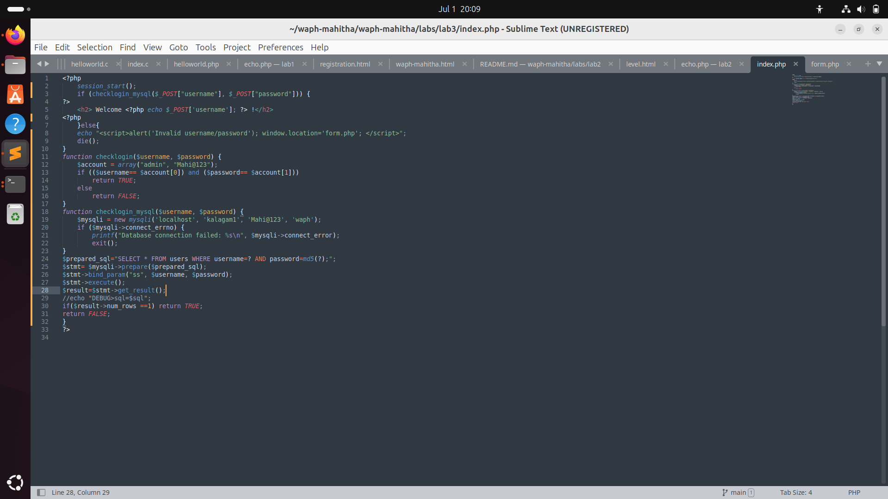

### Task 3: Performing XSS and SQL Injection Attacks 

#### Task 3.A: SQL Injection Attack  

To demonstrate a SQL injection vulnerability, I crafted a malicious payload and injected it into the username field on the login page. The payload was: kalagam1’ #

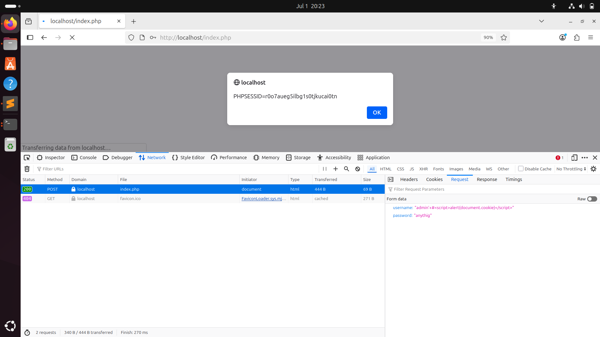

This payload allowed me to bypass authentication and gain access to the system. Additionally, the embedded JavaScript executed successfully, revealing the session ID through a cookie alert. The attack worked because user inputs were directly included in the SQL query without validation, making the webpage highly vulnerable to SQL injection. 

#### Task 3.B: Cross-Site Scripting (XSS)    

I tested the application for XSS by injecting a JavaScript snippet into a form input. Since the application did not sanitize the output before reflecting it back onto the page, the script was executed and displayed an alert box containing the session cookie. This demonstrated a stored/reflected XSS vulnerability.

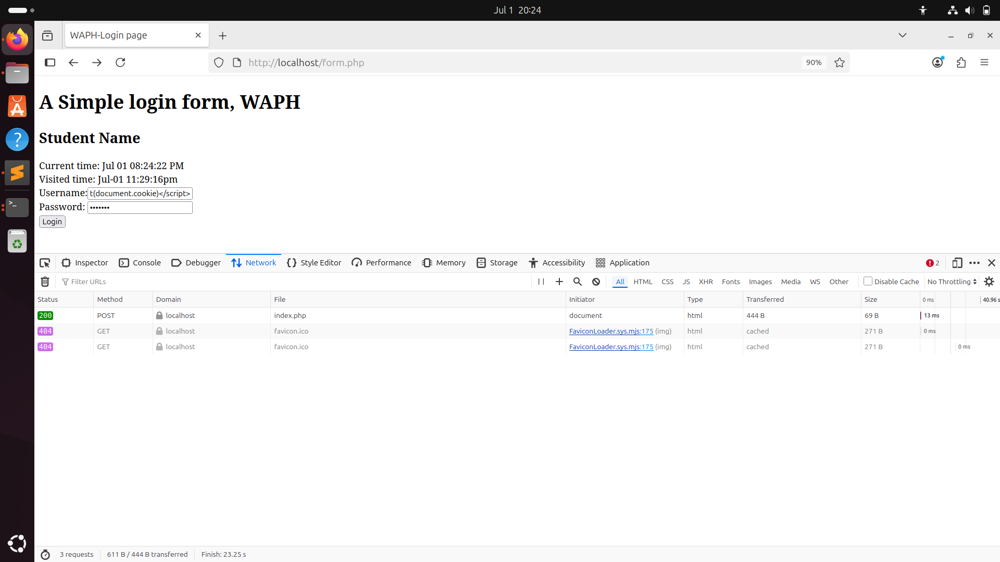

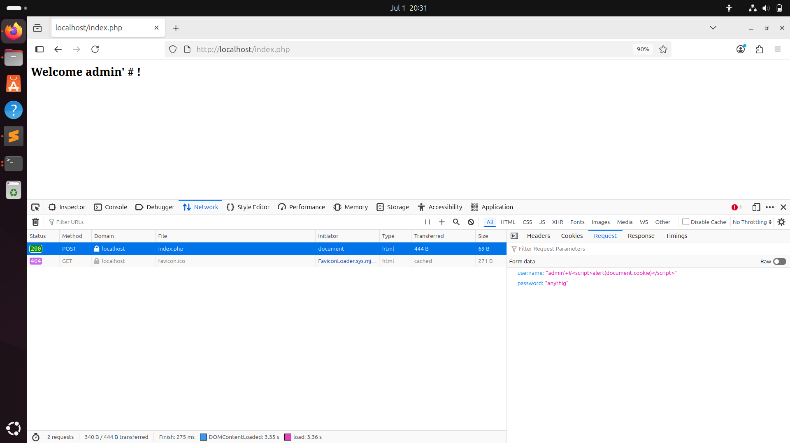

### Task 4: Prepared Statement Implementation

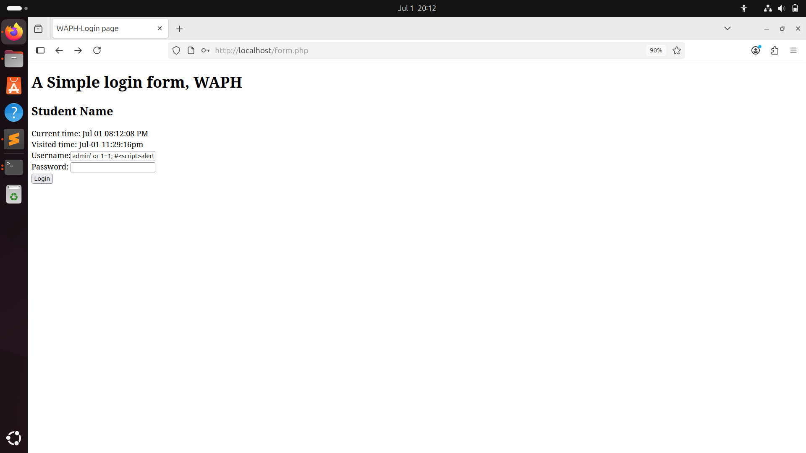

 - i. Prepared Statement for SQL Injection Prevention

To mitigate the SQL injection vulnerability identified earlier, I updated the index.php code to use prepared statements. These use placeholders (?) and bind user input at runtime, ensuring that the input is treated as data rather than part of the SQL query. In the updated implementation, I used POST to capture the input and applied prepare() and bind_param() functions from the MySQLi API. After redeploying the code, I tested the same injection payload, and this time the login failed with an “invalid credentials” message—confirming the SQL injection was successfully blocked.

 - ii. Security Analysis

I implemented output sanitization techniques to reduce XSS risk by escaping harmful characters before rendering them in HTML. Additionally, I analyzed the system for potential programming flaws such as empty username/password fields and case sensitivity in usernames. I added checks to handle these issues like password hashing (e.g., bcrypt) and secure session handling using HttpOnly and Secure flags. These improvements enhanced the security and reliability of the web application.
