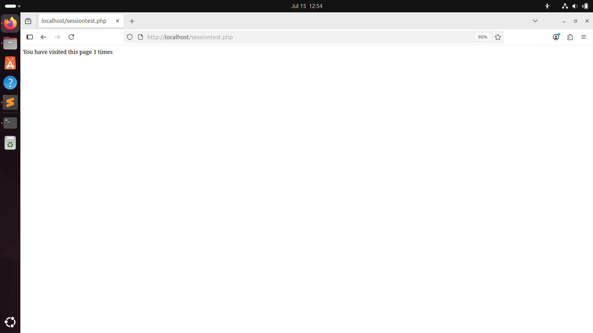
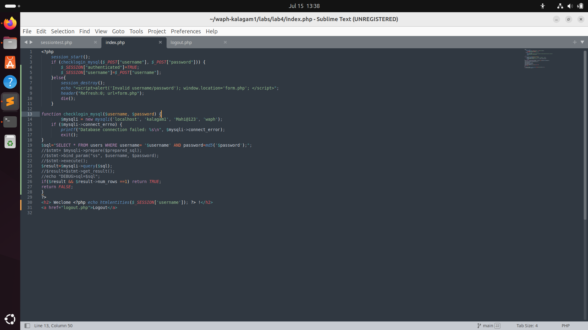

# Web Application Programming and Hacking

## Instructor: Dr. Phu Phung

## Student

**Name**: Mahitha Kalaga

**Email**: [kalagam1@udayton.edu](kalagam1@udayton.edu)

## Repository Information

Repository's URL: [https://github.com/kalagam1/waph-kalagam1.git](https://github.com/kalagam1/waph-kalagam1.git)

This is a private repository for Mahitha Kalaga to store all the code from the course. The organization of this repository is as follows.

### Labs

[Hands-on exercises in Lectures](labs)

- [Lab 0](labs/lab0): Development Environment Setup
- [Lab 1](labs/lab1): Foundations of the Web
- [Lab 2](labs/lab2): Front-end Web Development
- [Lab 3](labs/lab3): Secure Web Application Development in PHP/MySQL
- [Lab 4](labs/lab4): A Secure Login System with Session Authentication

### Hackathons

- [Hackathon 1](hackathon1): Cross-site Scripting Attacks and Defenses
- [Hackathon 2](hackathon2): SQL Injection Attacks
- [Hackathon 3](hackathon3): Session Hijacking Attacks and Defenses

### Individual Projects

- [Individual Project 1](https://github.com/kalagam1/kalagam1.github.io): Front-end Web Development with a Professional Profile Website and API Integration on github.io cloud service

## Report

## The lab's overview

This lab focused on implementing secure session management in PHP-based web applications, highlighting risks like session hijacking and ways to defend against them. Tasks included deploying and testing session behavior, analyzing HTTP traffic with Wireshark, simulating session hijacking attacks, and building a basic login system using sessions. Security measures such as enabling HTTPS, setting HttpOnly and Secure cookie flags, and detecting session hijacking through browser checks were implemented. Through this lab, I gained practical experience in both exploiting insecure session handling and applying effective countermeasures to protect user authentication.

Lab's URL: [Lab4](https://github.com/kalagam1/waph-kalagam1/tree/main/labs/lab4)

## Part 1 - Understanding Session Management in a PHP Web Application

#### Task 1.A: Deploy and test sessiontest.php

The script did not track the number of visits due to the absence of session management logic. To enable session tracking, I inserted the session_start(); function at the top of the PHP file. After making this change and deploying the file to the web directory using sudo cp, the page began displaying and updating the session visit count with each refresh. Testing in Chrome and Firefox showed different session IDs, verifying that PHP maintains sessions independently per browser.

#### Task 1.B: Observing Session Handshaking with Wireshark

After deploying session.php, I launched Wireshark to analyze the HTTP traffic during a page visit. On the first visit, there was no cookie sent by the client. However, the server responded with a Set-Cookie header containing a unique session ID. On frequent visits, this session ID was included in the client’s request via the Cookie header, demonstrating the session persistence mechanism.

#### Task 1.C: Understanding Session Hijacking

To demonstrate session hijacking, I loaded the session.php page in Chrome, used the document.cookie command to retrieve the session ID, and manually copied it into Firefox’s developer console. After setting the cookie using document.cookie = "PHPSESSID=..." in Firefox, the page displayed the same session state as Chrome.

### Task 2: Insecure Session Authentication

#### Task 2.A: Revised Login System with Session Management

I took the index.php file from Lab 3 and modified it to include session-based access control. I copied the files (index.php, form.php, logout.php) to the Lab 4 directory and edited them. The logic was updated to verify authentication using session variables and restrict access to unauthorized users. A logout.php script was added to destroy the session. After deployment, the system correctly displayed login errors for invalid credentials and maintained authenticated sessions for valid users.

#### Task 2.B: Session Hijacking Attacks

To demonstrate vulnerability in the revised login system, I used document.cookie to extract the session ID from a logged-in user in one browser. I then injected this session ID into another browser. Upon refreshing the second browser, it was granted access to the authenticated session, proving that session hijacking is possible if the session ID is exposed.

### Task 3: Securing Session and Session Authentication

#### Task 3.A: Data Protection and HTTPS Setup 

To secure data in transit, I generated a self-signed SSL certificate using OpenSSL with a 4096-bit RSA key. The .crt and .key files were copied into the Apache SSL directories (/etc/ssl/certs and /etc/ssl/private). I then edited the Apache SSL configuration file (default-ssl.conf) to point to the certificate files. After enabling the SSL module and restarting Apache, the application became accessible via HTTPS.

#### Task 3.B: Securing Sessions with HttpOnly and Secure Flags  

To strengthen session protection, I modified the PHP configuration to set the HttpOnly and Secure flags for cookies. These settings were defined using session_set_cookie_params() before invoking session_start(). The HttpOnly flag ensures cookies cannot be accessed via JavaScript, mitigating XSS risks, while the Secure flag ensures cookies are only sent over HTTPS. These changes were tested by attempting to access the session cookie from the browser console.

#### Task 3.C: Defense In-Depth: Detecting Session Hijacking

I implemented session hijack detection by checking for mismatches in client information (e.g., user agent or IP address) between requests. If a mismatch was detected, the application triggered a JavaScript alert stating “Session hijacking is detected” and redirected the user to the login page.

